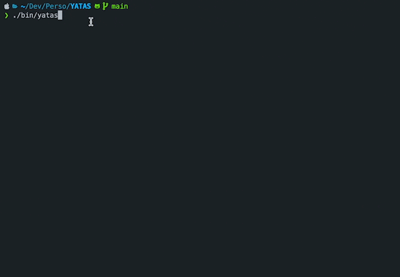
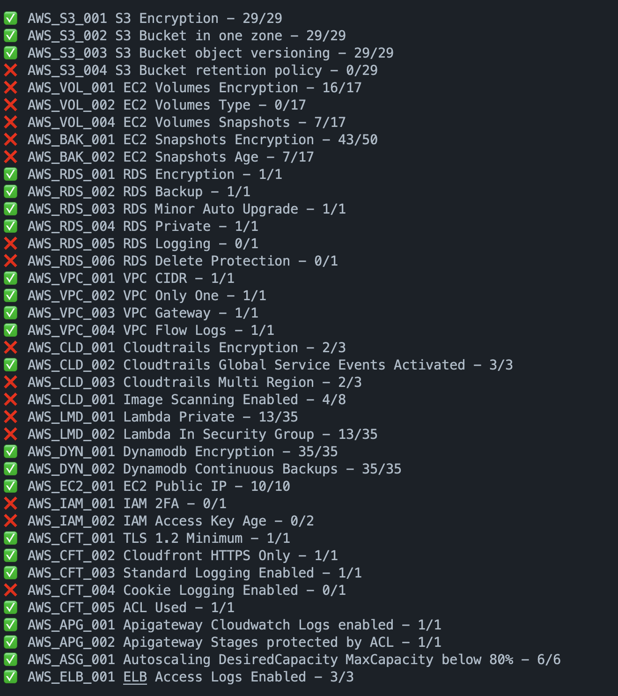

<p align="center">

<p align="center">

# YATAS
[](https://codecov.io/gh/padok-team/YATAS) [](https://goreportcard.com/badge/github.com/padok-team/yatas)

Yet Another Testing &amp; Auditing Solution 

The goal of YATAS is to help you create a secure AWS environment without too much hassle. It won't check for all best practices but only for the ones that are important for you based on my experience. Please feel free to tell me if you find something that is not covered.

## Features
YATAS is a simple and easy to use tool to audit your infrastructure for misconfiguration or potential security issues.

<p align="center">

<p align="center">

| No details                | Details
|:-------------------------:|:-------------------------:
|       |  

## Installation

```bash
brew tap padok-team/tap
brew install yatas
```

```bash
yatas --init
```

Modify .yatas.yml to your needs.

```bash
yatas --install
```

Installs the plugins you need.

## Usage

```bash
yatas -h
```

Flags:
- `--details`: Show details of the issues found.
- `--compare`: Compare the results of the previous run with the current run and show the differences.
- `--ci`: Exit code 1 if there are issues found, 0 otherwise.
- `--resume`: Only shows the number of tests passing and failing.
- `--time`: Shows the time each test took to run in order to help you find bottlenecks.
- `--init`: Creates a .yatas.yml file in the current directory.
- `--install`: Installs the plugins you need.
- `--only-failure`: Only show the tests that failed.
- 

## Plugins

| Plugins | Description | Checks |
|------|-------------|--------|
| [*AWS Audit*](https://github.com/padok-team/yatas-aws) | AWS checks | Good practices and security checks|
| [*Markdown Reports*](https://github.com/padok-team/yatas-markdown) | Reporting | Generates a markdown report |


## Checks 

### Ignore results for known issues
You can ignore results of checks by adding the following to your `.yatas.yml` file:

```yaml
ignore:
  - id: "AWS_VPC_004"
    regex: true
    values: 
      - "VPC Flow Logs are not enabled on vpc-.*"
  - id: "AWS_VPC_003"
    regex: false
    values: 
      - "VPC has only one gateway on vpc-08ffec87e034a8953"
```

### Exclude a test
You can exclude a test by adding the following to your `.yatas.yml` file:

```yaml
plugins:
  - name: "aws"
    enabled: true
    description: "Check for AWS good practices"
    exclude:
      - AWS_S3_001
```

### Specify which tests to run 

To only run a specific test, add the following to your `.yatas.yml` file:

```yaml
plugins:
  - name: "aws"
    enabled: true
    description: "Check for AWS good practices"
    include:
      - "AWS_VPC_003"
      - "AWS_VPC_004"
```

### Get error logs

You can get the error logs by adding the following to your env variables:

```bash
export YATAS_LOG_LEVEL=debug
```
The available log levels are: `debug`, `info`, `warn`, `error`, `fatal`, `panic` and `off` by default


<!-- BEGIN_YATAS -->

## AWS - 63 Checks

### AWS Certificate Manager
- AWS_ACM_001 ACM certificates are valid
- AWS_ACM_002 ACM certificate expires in more than 90 days
- AWS_ACM_003 ACM certificates are used

### APIGateway
- AWS_APG_001 ApiGateways logs are sent to Cloudwatch
- AWS_APG_002 ApiGateways are protected by an ACL
- AWS_APG_003 ApiGateways have tracing enabled

### AutoScaling
- AWS_ASG_001 Autoscaling maximum capacity is below 80%
- AWS_ASG_002 Autoscaling group are in two availability zones

### Backup
- AWS_BAK_001 EC2's Snapshots are encrypted
- AWS_BAK_002 EC2's snapshots are younger than a day old

### Cloudfront
- AWS_CFT_001 Cloudfronts enforce TLS 1.2 at least
- AWS_CFT_002 Cloudfronts only allow HTTPS or redirect to HTTPS
- AWS_CFT_003 Cloudfronts queries are logged
- AWS_CFT_004 Cloudfronts are logging Cookies
- AWS_CFT_005 Cloudfronts are protected by an ACL

### CloudTrail
- AWS_CLD_001 Cloudtrails are encrypted
- AWS_CLD_002 Cloudtrails have Global Service Events Activated
- AWS_CLD_003 Cloudtrails are in multiple regions

### COG
- AWS_COG_001 Cognito allows unauthenticated users

### DynamoDB
- AWS_DYN_001 Dynamodbs are encrypted
- AWS_DYN_002 Dynamodb have continuous backup enabled with PITR

### EC2
- AWS_EC2_001 EC2s don't have a public IP
- AWS_EC2_002 EC2s have the monitoring option enabled

### ECR
- AWS_ECR_001 ECRs image are scanned on push
- AWS_ECR_002 ECRs are encrypted
- AWS_ECR_003 ECRs tags are immutable

### EKS
- AWS_EKS_001 EKS clusters have logging enabled
- AWS_EKS_002 EKS clusters have private endpoint or strict public access

### LoadBalancer
- AWS_ELB_001 ELB have access logs enabled

### GuardDuty
- AWS_GDT_001 GuardDuty is enabled in the account

### IAM
- AWS_IAM_001 IAM Users have 2FA activated
- AWS_IAM_002 IAM access key younger than 90 days
- AWS_IAM_003 IAM User can't elevate rights
- AWS_IAM_004 IAM Users have not used their password for 120 days

### Lambda
- AWS_LMD_001 Lambdas are private
- AWS_LMD_002 Lambdas are in a security group
- AWS_LMD_003 Lambdas are not with errors

### RDS
- AWS_RDS_001 RDS are encrypted
- AWS_RDS_002 RDS are backedup automatically with PITR
- AWS_RDS_003 RDS have minor versions automatically updated
- AWS_RDS_004 RDS aren't publicly accessible
- AWS_RDS_005 RDS logs are exported to cloudwatch
- AWS_RDS_006 RDS have the deletion protection enabled
- AWS_RDS_007 Aurora Clusters have minor versions automatically updated
- AWS_RDS_008 Aurora RDS are backedup automatically with PITR
- AWS_RDS_009 Aurora RDS have the deletion protection enabled
- AWS_RDS_010 Aurora RDS are encrypted
- AWS_RDS_011 Aurora RDS logs are exported to cloudwatch
- AWS_RDS_012 Aurora RDS aren't publicly accessible

### S3 Bucket
- AWS_S3_001 S3 are encrypted
- AWS_S3_002 S3 buckets are not global but in one zone
- AWS_S3_003 S3 buckets are versioned
- AWS_S3_004 S3 buckets have a retention policy
- AWS_S3_005 S3 bucket have public access block enabled

### Volume
- AWS_VOL_001 EC2's volumes are encrypted
- AWS_VOL_002 EC2 are using GP3
- AWS_VOL_003 EC2 have snapshots
- AWS_VOL_004 EC2's volumes are unused

### VPC
- AWS_VPC_001 VPC CIDRs are bigger than /20
- AWS_VPC_002 VPC can't be in the same account
- AWS_VPC_003 VPC only have one Gateway
- AWS_VPC_004 VPC Flow Logs are activated
- AWS_VPC_005 VPC have at least 2 subnets

<!-- END_YATAS -->

## How to create a new plugin ?

You'd like to add a new plugin ? Then simply visit [yatas-plugin](https://github.com/padok-team/yatas-template) and follow the instructions.


  <h2>Contributors ❤️</h2>
  <br />
  <div align="center">
  <br />
  <a href="https://github.com/padok-team/yatas/graphs/contributors">
    
  </a>
  <br/>
  <br/>
  <h4>Your contributions are very welcome, feel free to add new rules to YATAS !</h4>
  <br />
  <br />
</div>